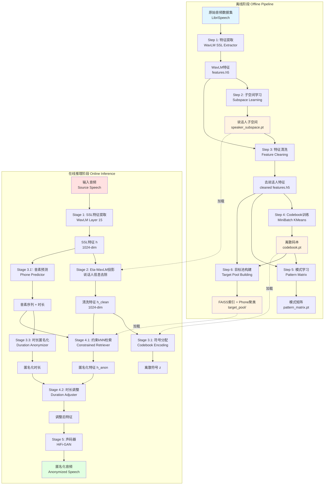
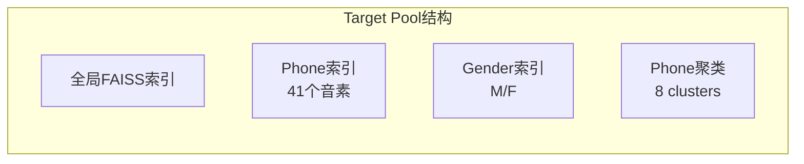
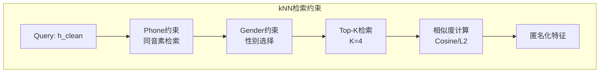
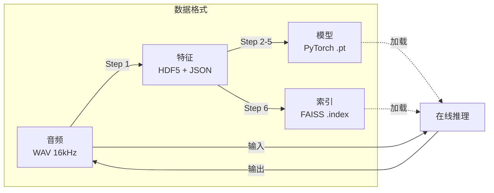

# 语音匿名化系统架构图

## 整体架构

## 离线阶段详细流程

### Step 1: 特征提取 (Feature Extraction)
- **输入**: LibriSpeech音频数据集
- **模型**: WavLM-Large (Layer 15)
- **输出**: HDF5格式特征文件 + 元数据JSON
- **关键参数**:
  - 特征维度: 1024
  - 采样率: 16kHz
  - 帧移: 320 samples (20ms)

### Step 2: 子空间学习 (Subspace Learning)
- **算法**: PCA降维
- **目标**: 学习说话人子空间 U_s
- **输出**: speaker_subspace.pt (64维子空间)
- **优化**: Welford在线算法，避免OOM

### Step 3: 特征清洗 (Feature Cleaning)
- **方法**: Eta-WavLM投影
- **公式**: h_clean = h - U_s @ U_s^T @ h
- **作用**: 去除说话人相关信息
- **输出**: cleaned features.h5

### Step 4: Codebook训练 (Codebook Training)
- **算法**: MiniBatch KMeans
- **码本大小**: 512
- **训练方式**: 流式训练，分段采样
- **输出**: codebook.pt

### Step 5: 模式学习 (Pattern Learning)
- **目标**: 学习符号转移模式
- **输出**: pattern_matrix.pt
- **用途**: 符号序列平滑（v3.0已禁用）

### Step 6: 目标池构建 (Target Pool Building)
- **索引类型**:
  - FAISS IVF索引 (全局检索)
  - Phone-based子索引 (41个音素)
  - Gender-based子索引 (M/F)
- **Phone聚类**: KMeans聚类 (8个cluster)
- **输出**:
  - faiss.index
  - phone_clusters.pkl
  - metadata.json

## 在线推理阶段详细流程

### Stage 1: SSL特征提取
- **模型**: WavLM-Large (Layer 15)
- **输入**: 16kHz单声道音频
- **输出**: h [T, 1024]

### Stage 2: Eta-WavLM投影
- **加载**: speaker_subspace.pt
- **投影**: h_clean = h - U_s @ U_s^T @ h
- **作用**: 去除源说话人信息
- **可配置**: use_eta_wavlm (默认True)

### Stage 3: 符号与音素处理
**3.1 符号分配**
- 加载: codebook.pt
- 方法: 最近邻量化
- 输出: z [T] 离散符号序列

**3.1' 音素预测**
- 模型: Phone Predictor
- 输出: 音素序列 + 帧级音素标签

**3.2 音素时长提取**
- 方法: 连续相同音素合并
- 输出: phone_ids, true_durations

**3.3 时长匿名化**
- 策略: Duration Predictor (70%) + 随机噪声 (30%)
- 噪声: Gaussian(0, 0.1)
- 输出: anon_durations

### Stage 4: kNN检索与时长调整
**4.1 约束kNN检索**
- 加载: target_pool/
- 约束类型:
  - Phone约束: 同音素检索
  - Gender约束: 同性别/跨性别
- 检索策略:
  - Top-1 (默认) 或 加权平均
  - 余弦相似度 (默认) 或 L2距离
- K值: 4
- 输出: h_anon [T, 1024]

**4.2 时长调整**
- 方法: 线性插值/重采样
- 输入: h_anon + phone_segments + anon_durations
- 输出: h_anon_adjusted

### Stage 5: 声码器合成
- **模型**: HiFi-GAN
- **输入**: h_anon_adjusted [T, 1024]
- **输出**: 16kHz音频波形

## 关键技术点

### 1. 内存优化
- **Welford算法**: 在线计算均值/方差
- **流式训练**: MiniBatch KMeans分段训练
- **HDF5存储**: 大规模特征高效存储
- **断点续传**: 支持中断恢复

### 2. 检索优化
- **FAISS GPU加速**: IVF索引快速检索
- **Phone聚类**: 减少检索空间
- **Top-1策略**: 避免特征模糊

### 3. 匿名化策略
- **说话人去除**: Eta-WavLM子空间投影
- **时长匿名化**: 预测器 + 随机噪声
- **特征替换**: 约束kNN检索目标池

### 4. 质量保证
- **语义保持**: Phone约束检索
- **自然度**: HiFi-GAN高质量合成
- **隐私保护**: 多层匿名化机制

## 数据流图

## 配置文件结构

- `configs/base.yaml`: 基础配置
- `configs/large_scale.yaml`: 大规模数据配置
- 关键配置项:
  - `paths`: 数据路径、模型路径
  - `ssl`: WavLM层数、特征维度
  - `eta_wavlm`: 子空间维度
  - `samm`: Codebook大小、掩码参数
  - `knn_vc`: K值、聚类数、约束类型
  - `duration`: 时长匿名化参数
  - `target_selection`: 性别选择策略
